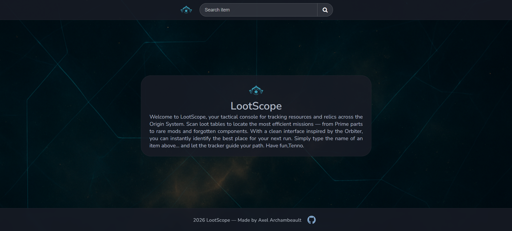
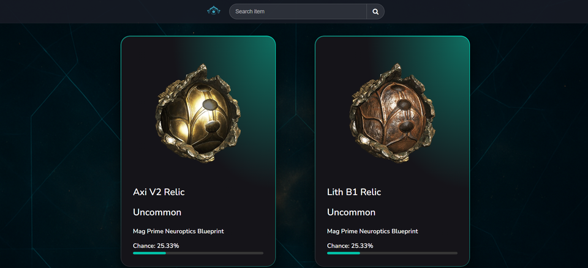

# ⚔️ LootScope

**LootScope** est une application web inspirée de l'univers de **Warframe** permettant de trouver rapidement **les meilleurs endroits pour obtenir un objet dans le jeu**.

Cette application analyse les tables de loot et affiche les missions avec :

- 📍 leur **localisation**
- 🎯 leur **rareté**
- 📊 leur **chance de drop**

L'objectif est simple : **aider les Tenno à optimiser leur farm** grâce à une interface claire et rapide.

---

## 🚀 Aperçu

Une application web où l'utilisateur peut :

1. Rechercher **n'importe quel objet du jeu**
2. Voir **où il peut être obtenu**
3. Connaître **les chances de drop**
4. Comparer **les différentes sources possibles**

Tout cela dans une interface inspirée du **terminal de l'Orbiter**.

---

## 🖼️ Interface

### Accueil

### Page de recherche

---

## ✨ Fonctionnalités

✔️ Recherche rapide d'objets  
✔️ Affichage des chances de drop avec barre de progression  
✔️ Cartes visuelles pour chaque source de loot  
✔️ Interface inspirée de l'univers Warframe  
✔️ Design responsive (mobile / desktop)  
✔️ Interface simple et rapide  

---

## 🛠️ Technologies utilisées

| Technologie | Description |
|-------------|-------------|
| Python | Langage principal |
| Flask | Framework web backend |
| Jinja2 | Moteur de templates |
| [https://api.warframestat.us/drops/](https://api.warframestat.us/drops/) | API pour avoir les données à jour |
| HTML / CSS | Interface utilisateur |

---

## 📱 Responsive Design

LootScope est conçu pour fonctionner sur :

💻 Ordinateur  
📱 Téléphone  
📟 Tablette  

L'interface s'adapte automatiquement à la taille de l'écran.

---

## 🎯 Objectif du projet

Ce projet a été réalisé pour :

- pratiquer le développement web avec Flask
- manipuler des données provenant d'API
- créer une interface utilisateur immersive
- développer un outil utile pour les joueurs

---

## ⚠️ Disclaimer

Ce projet est un **fan project** et n'est pas affilié avec Warframe ni ses créateurs.

Toutes les références appartiennent à leurs propriétaires respectifs.

---

## 👨‍💻 Auteur

**Axel Archambeault 2025**
